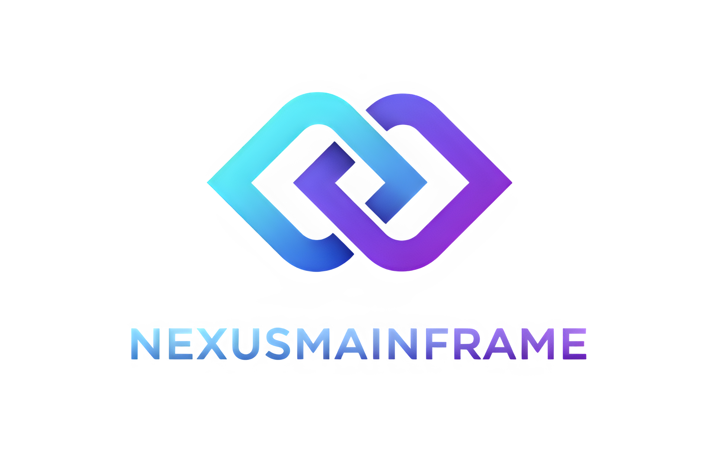

<div align="center">
  

[](https://github.com/Justin9091/NexusMainframe/actions)
[](LICENSE)
[](https://isocpp.org/)
[](https://cmake.org/)
[](https://coveralls.io/github/Justin9091/NexusMainframe?branch=main)

</div>

# Nexus Mainframe

Nexus Mainframe is a modular C++20 framework for building event-driven applications on Windows and Linux. It provides a plugin-based architecture, REST/WebSocket API, MQTT integration, cron scheduling, and flexible configuration management.

## Features

- **Modular plugin system** — dynamically load/unload `.dll`/`.so` modules at runtime
- **REST API** — HTTP server on port 8080 with device, room, module, and config endpoints
- **WebSocket server** — real-time event streaming
- **MQTT client** — configurable broker connection
- **Cron scheduler** — cron expression-based task scheduling via croncpp
- **EventBus** — decoupled publish/subscribe communication between components
- **IPC** — TCP command server on port 9999
- **MCP server** — Model Context Protocol support

## Build

**Requirements:** C++20 compiler, CMake 3.20+, Ninja, OpenSSL (Linux/macOS)

```bash
# Debug
cmake -B build -G Ninja
cmake --build build

# Release
cmake -B build -G Ninja -DCMAKE_BUILD_TYPE=Release
cmake --build build

# With tests
cmake -B build -G Ninja -DNEXUS_BUILD_TESTS=ON
cmake --build build
ctest --test-dir build
```

## HTTP API

| Method | Path | Description |
|--------|------|-------------|
| GET | `/api/status` | Health check |
| GET | `/api/health` | Uptime, MQTT status, loaded modules |
| GET | `/api/metrics` | Memory and runtime metrics |
| GET | `/api/modules` | List loaded modules |
| POST | `/api/modules/:name/enable` | Load a module |
| POST | `/api/modules/:name/disable` | Unload a module |
| GET | `/api/devices` | List devices |
| POST | `/api/devices` | Add a device |
| DELETE | `/api/devices/:id` | Remove a device |
| GET | `/api/rooms` | List rooms |
| GET/PATCH | `/api/config` | Read or update configuration |

## License

MIT — see [LICENSE](LICENSE) for details.
